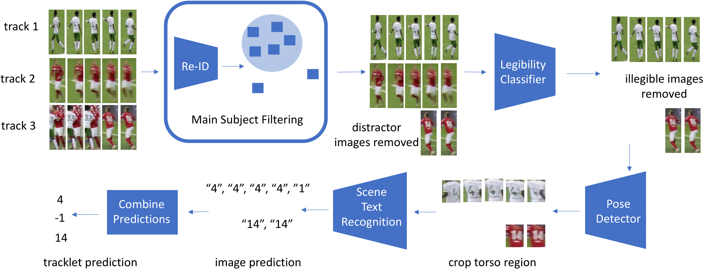

# Enhanced Jersey Number Recognition for Sports Video

This repository contains code for an enhanced jersey number recognition pipeline for sports video, extending the framework from **[A General Framework for Jersey Number Recognition in Sports](https://openaccess.thecvf.com/content/CVPR2024W/CVsports/papers/Koshkina_A_General_Framework_for_Jersey_Number_Recognition_in_Sports_Video_CVPRW_2024_paper.pdf)** by Maria Koshkina and James H. Elder.

The project keeps the original multi-stage recognition pipeline while adding practical ML engineering improvements across preprocessing, pose estimation, GPU inference, temporal modeling, prediction consolidation, and pipeline integration.



## Overview

The original pipeline follows:

```text
player tracklets
    -> re-identification filtering
    -> legibility classification
    -> pose estimation
    -> pose-guided jersey cropping
    -> scene-text recognition
    -> tracklet prediction consolidation
```

Our course-project work adds a "bag of tricks" around this architecture to improve robustness, efficiency, and experimentability without changing the core research framing.

## Key Optimizations

### Temporal smoothing for pose keypoints

We added exponential moving-average smoothing across consecutive pose predictions before jersey-region cropping.

```python
alpha = 0.5
smoothed = alpha * current + (1 - alpha) * previous
```

This reduces frame-to-frame keypoint jitter in player tracklets and makes downstream pose-guided crops more stable.

### Mixed-precision ViTPose inference

ViTPose inference now uses CUDA FP16 autocast when a GPU is available:

```python
with torch.autocast("cuda", dtype=torch.float16):
    ...
```

The pose stage also selects CUDA dynamically and falls back to CPU when needed, improving portability across execution environments.

### Flash Attention experimentation

As part of the course project, the ViTPose attention implementation was modified to experiment with a more efficient attention path.

[ViTPose Flash Attention modification](https://github.com/chinmayarvind23/ViTPose/commit/a993f2c6710a99a7f63fae86608e800c02a4837c)

### More permissive pose-guided cropping

The torso/keypoint confidence threshold used for crop generation was lowered from `0.40` to `0.05`, allowing lower-confidence but still useful keypoints to contribute to jersey-region localization.

### Image denoising

We added an OpenCV preprocessing stage using Non-Local Means denoising:

```python
cv2.fastNlMeansDenoisingColored(...)
```

The denoising pipeline preserves the original SoccerNet tracklet directory structure so it can be inserted before downstream recognition.

### Robustness-oriented augmentation

A custom augmentation stage masks alternating pixel locations to simulate partial visual degradation while preserving the tracklet structure of the dataset.

This provides an additional robustness stressor for downstream recognition models.

### Learned tracklet prediction consolidation

The original pipeline aggregates frame-level jersey predictions with confidence-based logic.

We added a **bidirectional LSTM consolidator** that learns from the sequence of:

- frame-level jersey-number predictions
- prediction confidence values

```text
frame predictions + confidences
            |
            v
        embeddings
            |
            v
    bidirectional LSTM
            |
            v
   final tracklet jersey ID
```

This reframes final jersey-number selection as a learned sequence-modeling problem rather than relying only on hand-designed aggregation.

### Training and pipeline integration improvements

Additional engineering changes include:

- updated legibility-classifier optimizer integration
- safer CUDA/CPU device handling
- robust pose-keypoint serialization for JSON outputs
- compatibility fixes for the bundled PARSeq version
- configurable execution of individual pipeline stages
- end-to-end pipeline runtime instrumentation
- environment and execution-path fixes across the multi-model pipeline

## ML System Architecture

```text
Sports Video / Player Tracklets
            |
            v
      Re-ID Features
            |
            v
   Gaussian Outlier Filter
            |
            v
  Legibility Classification
            |
            v
       ViTPose Inference
   +-----------------------+
   | temporal smoothing    |
   | mixed precision       |
   | attention experiments |
   +-----------------------+
            |
            v
    Pose-Guided ROI Crops
            |
            v
      PARSeq Scene-Text
        Recognition
            |
            v
 Frame Prediction + Confidence
            |
            v
 Bidirectional LSTM Consolidation
            |
            v
      Final Jersey Number
```

The project combines computer vision, pose estimation, representation learning, scene-text recognition, temporal modeling, GPU inference optimization, data preprocessing, and end-to-end ML pipeline engineering.

## Pipeline Components

### Image-level recognition

Experiments on the Hockey dataset include:

- legibility classification
- scene-text recognition for jersey numbers

### Tracklet-level recognition

Experiments on SoccerNet include:

- occlusion/outlier removal using re-identification features and Gaussian filtering
- legibility classification
- pose-guided ROI cropping
- scene-text recognition for jersey numbers
- tracklet prediction consolidation

## Requirements

- PyTorch
- OpenCV

The full pipeline also depends on several external research repositories and model implementations.

## Setup

Clone the repository and create the required environments.

Run:

```bash
python3 setup.py
```

to set up supported dependencies and model components.

Alternatively, configure each dependency manually.

### SAM

Repository:

[https://github.com/davda54/sam](https://github.com/davda54/sam)

### Centroid-ReID

Repository:

[https://github.com/mikwieczorek/centroids-reid](https://github.com/mikwieczorek/centroids-reid)

Download the Centroid-ReID model weights:

[centroid-reid model weights](https://drive.google.com/file/d/1bSUNpvMfJkvCFOu-TK-o7iGY1p-9BxmO/view?usp=sharing)

Place them under:

```text
reid/centroids-reid/models
```

### ViTPose

Repository:

[https://github.com/ViTAE-Transformer/ViTPose](https://github.com/ViTAE-Transformer/ViTPose)

Download the ViTPose model weights:

[ViTPose model weights](https://1drv.ms/u/s!AimBgYV7JjTlgShLMI-kkmvNfF_h?e=dEhGHe)

Place them under:

```text
pose/ViTPose/checkpoints/
```

The course-project attention modification is available here:

[ViTPose Flash Attention modification](https://github.com/chinmayarvind23/ViTPose/commit/a993f2c6710a99a7f63fae86608e800c02a4837c)

### PARSeq

This repository includes the PARSeq version used by the jersey-number recognition pipeline.

Original PARSeq repository:

[https://github.com/baudm/parseq](https://github.com/baudm/parseq)

Model weights:

- [Original model weights](https://drive.google.com/file/d/1AK_GnM6pIYyfIf3tBYSKIyR3Fa3Z46Cx/view?usp=sharing)
- [Hockey fine-tuned](https://drive.google.com/file/d/1FyM31xvSXFRusN0sZH0EWXoHwDfB9WIE/view?usp=sharing)
- [SoccerNet fine-tuned](https://drive.google.com/file/d/1uRln22tlhneVt3P6MePmVxBWSLMsL3bm/view?usp=sharing)

## Data

### SoccerNet Jersey Number Recognition

Dataset:

[https://github.com/SoccerNet/sn-jersey](https://github.com/SoccerNet/sn-jersey)

Download and save under the `data` subfolder.

Additional resources:

- [Weakly-labelled player images used to train the legibility classifier](https://drive.google.com/file/d/1CmJfUmS_ZudgEiCT14b2CbyMA3nEO_uy/view?usp=sharing)
- [Weakly-labelled jersey-number crops used to fine-tune STR](https://drive.google.com/file/d/1PX8XDF3nNMZAvcjL6M5hurwX78ePAhSs/view?usp=sharing)

### Hockey

The Hockey data contains legibility and jersey-number datasets.

Request access from the original dataset authors and extract under:

```text
data/Hockey
```

### Trained Legibility Classifier Weights

- [Hockey](https://drive.google.com/file/d/1RfxINtZ_wCNVF8iZsiMYuFOP7KMgqgDp/view?usp=sharing)
- [SoccerNet](https://drive.google.com/file/d/18HAuZbge3z8TSfRiX_FzsnKgiBs-RRNw/view?usp=sharing)

## Configuration

Update `configuration.py` to set dataset paths, dependency paths, checkpoints, and output directories.

Individual pipeline stages can also be enabled or disabled from `main.py` for targeted experiments and profiling.

## Inference

### SoccerNet

Run:

```bash
python3 main.py SoccerNet test
```

The tracklet pipeline executes:

```text
ReID
-> outlier filtering
-> legibility classification
-> pose estimation
-> ROI cropping
-> scene-text recognition
-> tracklet consolidation
```

### Hockey

Run:

```bash
python3 main.py Hockey test
```

## Training

### Hockey legibility classifier

```bash
python3 legibility_classifier.py \
  --train \
  --arch resnet34 \
  --sam \
  --data <new-dataset-directory> \
  --trained_model_path ./experiments/hockey_legibility.pth
```

### Hockey PARSeq fine-tuning

```bash
python3 main.py Hockey train --train_str
```

### SoccerNet legibility fine-tuning

SoccerNet training uses weak labels generated from models trained on Hockey data.

```bash
python3 legibility_classifier.py \
  --finetune \
  --arch resnet34 \
  --sam \
  --data <new-dataset-directory> \
  --full_val_dir <new-dataset-directory>/val \
  --trained_model_path ./experiments/hockey_legibility.pth \
  --new_trained_model_path ./experiments/sn_legibility.pth
```

### SoccerNet PARSeq fine-tuning

```bash
python3 main.py SoccerNet train --train_str
```

## Project Lineage

This repository builds on the following work:

1. **A General Framework for Jersey Number Recognition in Sports Video** by Maria Koshkina and James H. Elder
2. Original implementation: [mkoshkina/jersey-number-pipeline](https://github.com/mkoshkina/jersey-number-pipeline)
3. Course-project extension: [MahmoudOsama97/jersey-number-pipeline_PlusPlus](https://github.com/MahmoudOsama97/jersey-number-pipeline_PlusPlus)

The enhancements in this project focus on pose stability, efficient inference, robustness-oriented preprocessing, learned temporal consolidation, and pipeline integration.

## Citation

If you use the underlying jersey-number recognition framework, please cite the original work:

```bibtex
@InProceedings{Koshkina_2024_CVPR,
    author    = {Koshkina, Maria and Elder, James H.},
    title     = {A General Framework for Jersey Number Recognition in Sports Video},
    booktitle = {Proceedings of the IEEE/CVF Conference on Computer Vision and Pattern Recognition (CVPR) Workshops},
    month     = {June},
    year      = {2024},
    pages     = {3235-3244}
}
```

## Acknowledgements

We would like to thank the authors of the following repositories:

- [PARSeq](https://github.com/baudm/parseq)
- [Centroid-ReID](https://github.com/mikwieczorek/centroids-reid)
- [ViTPose](https://github.com/ViTAE-Transformer/ViTPose)
- [SoccerNet](https://github.com/SoccerNet/sn-jersey)
- [McGill Hockey Player Tracking Dataset](https://github.com/grant81/hockeyTrackingDataset)
- [SAM](https://github.com/davda54/sam)

## License

[](http://creativecommons.org/licenses/by-nc/3.0/)

This work is licensed under a [Creative Commons Attribution-NonCommercial 3.0 Unported License](http://creativecommons.org/licenses/by-nc/3.0/).
